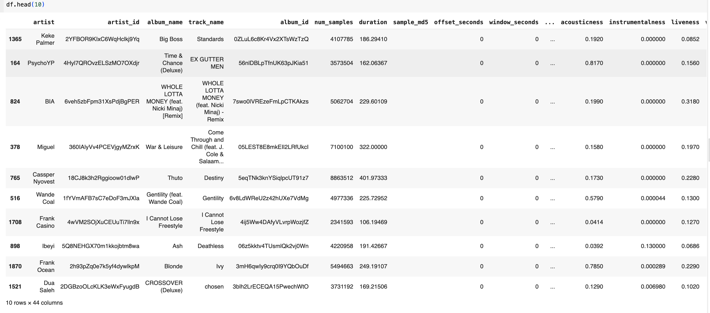
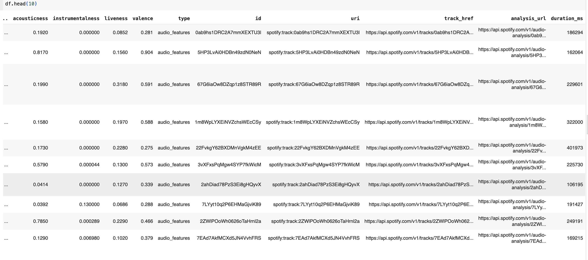
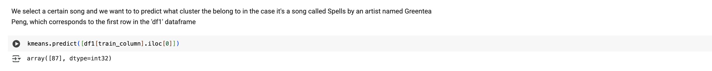
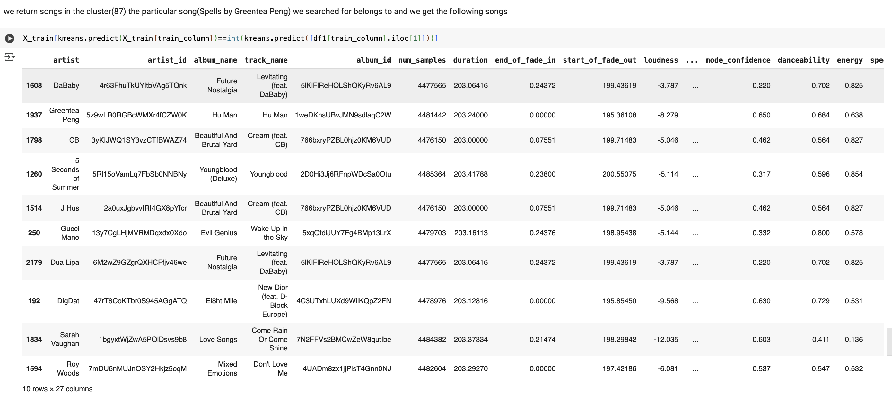
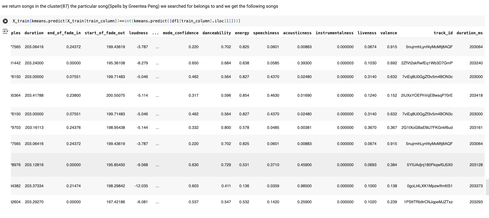

# 🎧 Music Recommendation System

A personal music recommender that uses Spotify's Web API to extract audio features, cluster songs using machine learning, and recommend tracks based on similarity.

## 🚀 Features

- Retrieves artist and track data from your Spotify account
- Uses audio features and analysis endpoints from Spotify
- Clusters songs using KMeans and silhouette scoring
- Recommends tracks from the same cluster as your input

## 📁 Project Structure

```
Music-Recommendation-System/
├── data/ # JSON files and feature cache
├── src/ # Project source code
│ ├── spotify_auth.py
│ ├── spotify_api.py
│ ├── pipeline.py
│ ├── clustering.py
│ └── search.py
├── assests # contains images of output
├── main.py # Entry point for running the pipeline
├── requirements.txt # Python package dependencies
├── .gitignore # Files to ignore in Git
└── README.md # Project documentation
```


## 🧪 How to Run

1. Set your Spotify API credentials:
```bash
export CLIENT_ID="your-client-id"
export CLIENT_SECRET="your-client-secret"
```


2. Install dependencies:
```bash
pip install -r requirements.txt
```

3. Run the pipeline:
```bash    
    python main.py
```

## 📊 Sample Output

Below is a demonstration of the data extraction and clustering process using the Spotify API (prior to deprecation):

### 🎼 Extracted Track Metadata and Features

**Track Info & Audio Features (Part 1)**


**Track Info & Audio Features (Part 2)**


### 🔍 User Search & Cluster Assignment

**User inputs a song** — “Spells” by Greentea Peng  


The system assigns it to cluster `87`.


### 🎧 Songs Recommended from the Same Cluster

**Cluster 87** contains tracks with similar audio features:

**Cluster 87 Results (Preview 1)**
  

**Cluster 87 Results (Preview 2)**



## ⚠️ Disclaimer

> This project was developed prior to Spotify’s 2024 API policy changes.  
> It is intended for educational and demonstration purposes only and does not distribute or train AI models using Spotify data.

## 📬 Author

Jordan Adeoye